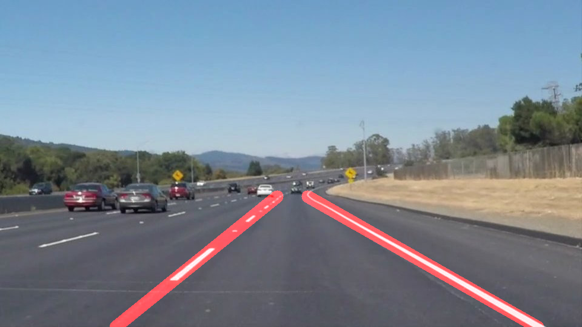
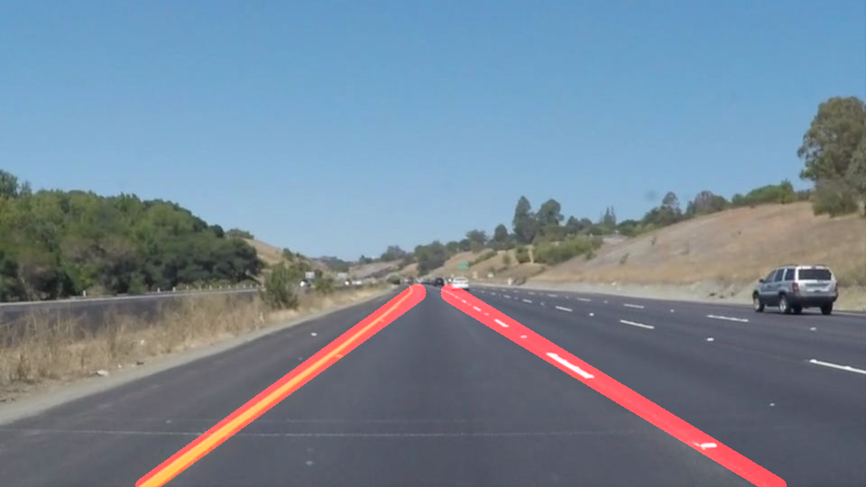

# **Finding Lane Lines on the Road** 

Overview
---

When we drive, we use our eyes to decide where to go.  The lines on the road that show us where the lanes are act as our constant reference for where to steer the vehicle.  Naturally, one of the first things we would like to do in developing a self-driving car is to automatically detect lane lines using an algorithm.

In this project you will detect lane lines in images using Python and OpenCV.  OpenCV means "Open-Source Computer Vision", which is a package that has many useful tools for analyzing images.  

Creating a Great Writeup
---
For this project, a great writeup should provide a detailed response to the "Reflection" section of the [project rubric](https://review.udacity.com/#!/rubrics/322/view). There are three parts to the reflection:

Files Included

1. P1.ipynb  
2. test_images_output/*  
    Processed Test images  
3. test_videos_output/*  
    Processed videos 
 

Describe the pipeline
    1. Select White and Yellow lines  
        The test images that are provided contain both white and yellow.  
        White Lanes  
         
        Yellow Lanes 
         
    2. Apply Gray Scale  
        This is needed for canny to properly detect edges  
    3. Apply Gaussian Smooting  
        Apply Gaussian Smoothing for the edges 
    4. Apply Canny  
        Detect the edges  
    5. Apply Hough transform after canny.  
        All the edges will result in lines in parameter space. The point of intersect in the hough transform is the line in 
        image space with slope and constant
    6. Draw the lane lines  
        The lines from the hough are fed to this function. 
        Average slope intercept is derived from multiple lines.
        Lanes and drawn on the original image
         White Lanes 
         
        Yellow Lanes 
         

Link to Videos  
[White Lanes](https://youtu.be/Xv-tLLH5GOw)

[Yellow Lanes](https://youtu.be/xZGnnONLlWY)

2. Identify any shortcomings
    1. Curvature of the road is not considered.
 
3. Reflection:
    The current pipeline works in detecting the images with standard slopes more like straight lines. 
    The current pipeline will fail on the turning roads.  
    

